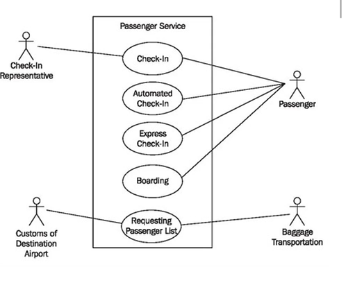

# Intro

* Quizes online, open friday
* No tests besides final

[Agile Manifesto](https://agilemanifesto.org/)

## Basics of Agile: User Stories, Use Cases, Users, Actors

* Agile user stories are short, simple descriptions of a software feature from an end-user's perspective, focusing on the value they receive, often using the format: "As a [user], I want [goal], so that [benefit]"

* Use Cases: Use cases detail how a system should behave in specific scenarios (actors, steps, flows), while user stories describe what a user wants to achieve and why, focusing on value in simple language

* Requirements: Must be testable. If you can't test them, how do you know if you have hit the requirement?

* actor vs user: an actor is a role that interacts with a system (human, machine, another system), representing a category, while a user is the specific person or entity playing that role. 
  * User classes represent groups of actual people or non-human users. A human user is a member of one or more user classes. You need to identify your product’s user classes so you know which people to talk with about requirements. You also need to understand which user classes are “favored” over others. Satisfying the needs of a favored user class is more important from a business perspective than meeting the needs of other groups of users. This distinction helps when making priority decisions and resolving requirement conflicts.
  * An actor is an abstraction, a role performed by a member of a specific user class when he interacts with a product at a specific time. When you are talking with user class representatives, have them identify the various roles that members of each class can perform from time to time. If those user roles involve interacting with the system through a use case, the roles represent actor names. Consider developing personas, descriptions of representative actors who can execute certain use cases.

* Achieving a Goal may result in the creation of artifacts
* These are called Postconditions
  * The system may have changed state
  * Data may have changed
  * Files may have been created or destroyed
  * Other output may have been generated

* Writing Use Cases is usually an iterative process
* In reviewing Use Cases, you nearly always uncover requirements that the Customer expects…but didn’t think about on their own …sometimes you need to think beyond what the Customer asks for in order to determine the complete Requirements (more User Stories may need to be written)

## Use Case Template: Use cases should be a verb phrase

* Title 
* Brief description including goal
* Identification of authors
* Pre-conditions (things that have to be true before the use case can be used)
* Scenarios
  * Basic/Sunny day flow
  * alternate flows
* Post-conditions/acceptance criteria (how do we know if we are done?)
* Additional notes

* Use case modeling was originally developed with UML in the 90s
  * contains Actors, Use Cases, and also Boundaries
    * Actor can also technically be another system
  * Each circle represents a use case
  * Large systems break down into a set of use cases
  * Square box indicates the boundaries of system being worked on
  * The line doesn't represent information flow; just involvement
  * Never one true use case diagram; you can break down the same problem in different ways
