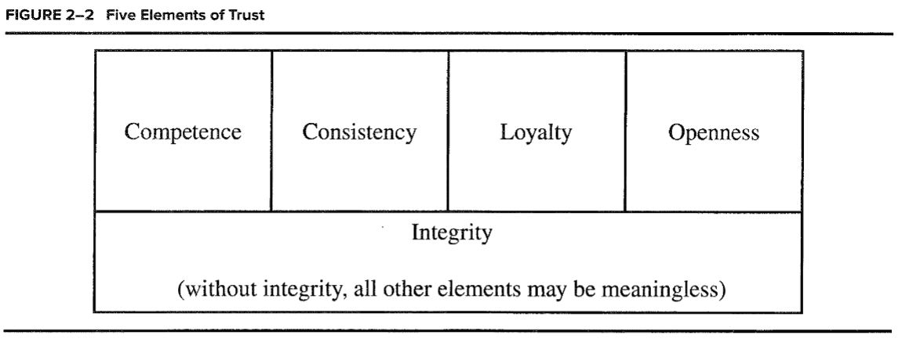

# Wk 2 Day 1 (Monday) Pre work

## Big Idea: self-disclosure

- this corresponds with chapter 2 from blindspot and chapter 2 from Interpersonal skills in organizations.

1. Based on the readings from both texts, consider how Johari's window from Chapter 2 in Interpersonal skills in organizations and the concepts of white lies, gray lies, colorless lies, blue lies, and red lies from Chapter 2 of Blindspot fit together
    - The first thing that sticks out to me is the relationship between blue lies and self disclosure. The hidden area corresponds to blue lies and the unknown area to a certain extent relates to the colorless lies, although you could argue that colorless lies have some implicit knowledge of self otherwise we wouldn't be telling them. What about the blind area? are there lies that people tell to us about our performance? Self-disclosure can be difficult if we don't feel like we get good/honest feedback, or have been conditioned by this pattern in the past. This idea is in general discussed, ideally we engage in self disclosure and trust to strengthen our relationships in the long term. In the short term however, there may be temporary benefits to lying.
Complete the Johari Window handout distributed in class in Week 1.Be prepared to discuss in class

2. From Chapter 2 in Interpersonal skills in organizations. Look at strategies for building trust (figure 2-2) and personal trust-builders:

What strategies are important to you in trusting others?

- Consistency and integrity. I feel consistency helps those who are less inclined to trust, trust, because at least they can more easily make & trust **their own** predictions of what you're gonna do.
What strategies are most challenging for you to do?
- Competence; I feel like I have in the past been not critical about my strengths and weaknesses in projects, and have tried to do/defended my performance on tasks that I wanted to do rather than what could've been the most beneficial to the org/team. The goal is not to be right all the time
    Be prepared to discuss in class

