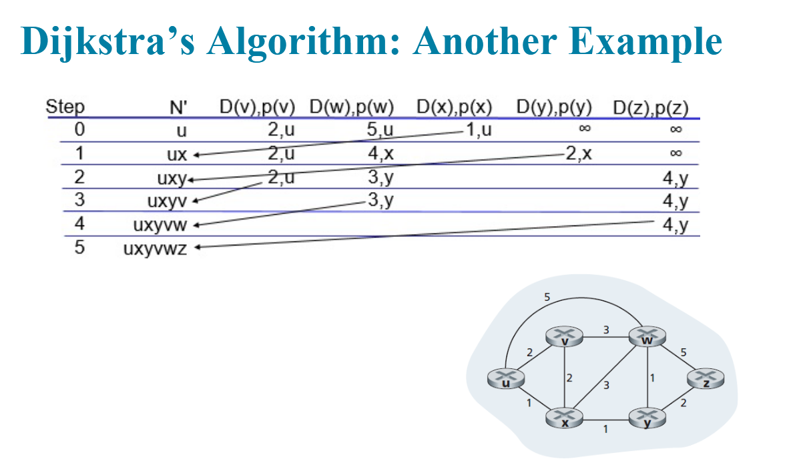
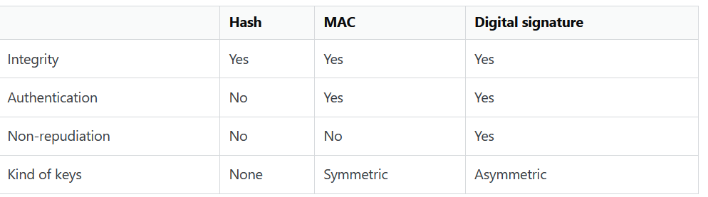

# things from the practice test & from the mid-term

## MAC vs PKI

* MAC (Message Authentication Code) provides message integrity & authenticity using a shared secret key (symmetric), ideal for fast checks like verifying a file hasn't changed, while PKI (Public Key Infrastructure) uses asymmetric keys (public/private) & certificates for identity, non-repudiation, and scalable trust (like digital signatures), underpinning secure web (TLS), email, and device authentication, but involves more overhead because asymmetric encryption is heavier than symmetric. **NOTE that asymmetric encryption can also provide integrity guarantees when used with digital signatures**  HMAC achieves both because it uses a shared secret key in conjunction with a cryptographic hash function:
  * Integrity: If an attacker alters even a single bit of the message, the recipient's re-calculated HMAC tag will not match the one sent, thus detecting the tampering. This is similar to a simple hash function.
  
  * Authenticity: Since only the legitimate sender and receiver possess the secret key, only they can generate or verify the correct HMAC tag for a given message. An attacker without the secret key cannot calculate a valid, matching HMAC for a tampered or forged message. This step proves the message originated from a trusted source.

* How does confidentiality work with TLS? This is where the symmetric secret key stuff comes in. HMAC provides message integrity and authenticity, proving data hasn't changed and comes from a trusted source, but does not offer confidentiality.

## See week #11 notes for credit card ATM example

## See week #11 notes for MAC vs HMAC

## Notes on what you messed up with regards to the Dijkstra's shortest path

* how do we choose the starting node? its just in the far left column starting set for N'

**Remember, the big focus for is is 1. Authentication and 2. Integrity. Can we very who sent us the message, and can we verify it hasnt been tampered with?**

* Integrity: Can the recipient be confident that the message has not been accidentally modified?

* Authentication: Can the recipient be confident that the message originates from the sender?

* Non-repudiation: If the recipient passes the message and the proof to a third party, can the third party be confident that the message originated from the sender?

## Public Key Signatures vs Public Key Encryption

* With public key encryption you encrypt using a public key. But when creating digital signatures you sign by encrypting a hash using a private key. A nonce (number used once) in digital signatures is
a random, unique value added to the signing process to prevent replay attacks and ensure each signature is unique, even for the same message.

* Anyone can produce an encrypted message (by using your public key) and only you can decrypt it (by using your private key). The roles of public and private key reverse because a signature has to be something that only you can produce (by encrypting with your private key) and everyone else can confirm (by decrypting with your public key).

* Encryption would be uselesss, if anyone could decrypt it, thus you have to need the private key for decrpytion. Conversely, a digital signature would not make sense if anyone could create it, ergo the private is required to create it.

## MAC/HMAC vs AES:

* MAC is used for integrity, while AES is used for Confidentiality/privacy. HMAC/MAC is not reversible, nor is it supposed to be. 
* We can use MAC to ensure the integrity/authentication of an API, as this is a situation where it makes sense to have a preshared private key

