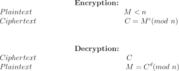

# Week 10 notes: Encryption week

## AES is a block cipher, ChaCha20 is a stream cipher

## Lecture 1: One-Time Pads, Stream Cipher, and Block Cipher

* Efficient attack scheme means faster than brute force

* Practical issue: from a security perspective, we would prefer to not re-use keys, but from a practical perspective, key generation is expensive and we would like to re-use keys because of this...

* You would want to convert a Block Cipher (like AES) into a Stream Cipher to achieve the benefits of stream encryption, primarily when encrypting arbitrarily long data streams or when speed and low latency are critical, even though block ciphers are not inherently designed for this.
  * But why not just use a stream cipher in the first place?
  * smaller library less moving parts to deal with, some companies support only AES because

* Every encryption algorithm has three components:
  1. Key Generation
  2. Encryption
  3. Decryption

* Claude Shannon proposed that there are two primitives with which strong encryptions algorithms can be built
  1. Confusion: an operation where the relationship between the key and ciphertext is obscured
  2. Diffusion: an operation where the influence of one plaintext symbol is spread over many ciphertext symbols with the goal of hiding the statistical properties/pattern in the plaintext
* Both operations by themselves cannot provide security, the idea is to mix elements to build security. Like for example diffusion 1 -> confusion 1 -> diffusion -> 2 -> confusion 2 ->...

### One-Time Pads

The one-time pad (OTP) is an encryption technique that cannot be cracked in cryptography. It requires the use of a single-use pre-shared key that is larger than or equal to the size of the message being sent. In this technique, a plaintext is paired with a random secret key (also referred to as a one-time pad). Then, each bit or character of the plaintext is encrypted by combining it with the corresponding bit or character from the pad using modular addition.

* Nice property of XOR: (x XOR y)XOR x = y
* This is in the symmetric key setting, so we assume both alice and bob know this key (share the key)
* The key is a randomly chosen bitstring; the key is equal length to the message
* Problems to solve that we can't solve with this basic scheme
  1. Key Exchange
  2. Key re-use
* The message is encoded by taking the XOR between the key and the message
* The message is de-coded by taking the XOR between the Key and the cypher
* Intuition of why this is secure: for a random encryption key, the distribution over the cypher bits is random. Suppose Eve intercepts ciphertext from Alice': EQNVZ. If Eve tried every possible key, she would find that the key XMCKL would produce the plaintext hello, but she would also find that the key TQURI would produce the plaintext later, an equally plausible message. 

* So what happens if we re-use a key? The attacker can take the XOR between both messages

* **The biggest issue in modern use is that the key must be the same length as the data, so 1 GB key for 1 GB data**

### Stream Cypher

* Family of Encryption Algorithms

* QUICK NOTE: pseudo-random can be informally defined as some sequence that can not be distinguished from uniform sampling. More formally, you have to pass a set of statistical tests to be truly pseudo-random
  * NIST SP 800-90A provides the statistical tests

* ChaCha20
  * He made a special note about making sure we understand the initialization vector
  * The Initialization Vector (IV) is a public, non-repeating value for a given key k.
  * The pair (k,IV) must never be used more than once.
  * You can re-use the key k if you use a new IV
  * If you re-use k with the same IV, you leak information about the plaintext, as the same plaintext would result in the same ciphertext

* So how to we generate actually random stuff? We collect sources of entropy from the real world (hopefully our computer hardware, maybe using the unpredictable behavior of hardware interrupts)
  * There are NIST approved RNGs

## Block Cypher

* A family of cryptographic algorithms consisting for fixed size blocks of bits

* we should know that DES is a block cypher and that its unsecure

    DES is insecure and should not be used.

* The primary reason for its insecurity is its small key size of 56 bits, making it vulnerable to exhaustive key search (brute-force) attacks.

* A family of cryptographic algorithms consisting for fixed size blocks of bits (e.g., 64 bits for DES, 128 bits for AES).

* Note on how DES is bad (See point above on 56-bit key).

* Note on S-box

    * The S-box (Substitution-box) is the crucial element for DES's security and is considered the heart of DES.

    * It is a non-linear substitution operation used to provide confusion.

* Note on Feistel network. Encrypts half of the plaintext each round

  * In a Feistel network (like DES), the plaintext is split into two halves, Li−1​ and Ri−1​.

  * In each round, the right half (Ri−1​) is fed into a function f, and the output is XORed with the left half (Li−1​).

  * The new halves are: Li​=Ri−1​ and Ri​=Li−1​⊕f(ki​,Ri−1​).

AES was introduced by NIST as a more secure block cypher in 2001. As of right now, AES 128 is secure

    AES-128 uses 10 rounds.

AES-192 uses 12 rounds, and AES-256 uses 14 rounds.

AES uses a substitution-permutation network (SPN).

* AES was introduced by NIST as a more secure block cypher in 2001. As of right now, AES 128 is secure
  * AES uses a substitution-permutation network 

## Lecture 2: Public Key Cryptography, RSA

**See HW 10 for example calculation**

* Unlike symmetric-key (e.g., Caesar Cipher, AES), which uses one shared key, public-key cryptography uses a pair of mathematically linked keys for a user:

    * Public Key (PK): Used to **encrypt** messages to the user or to verify a digital signature from the user. It is shared widely.

    * Private Key (SK): Used to **decrypt** messages sent to the user or to create a digital signature by the user. It must be kept secret.

* Two big benefits/uses:

* Confidentiality: A sender encrypts a message with the recipient's Public Key. Only the recipient's matching Private Key can decrypt it.

* Authentication/Integrity (Digital Signatures): The sender encrypts a hash of the message with their own Private Key (the "signature"). The recipient uses the sender's Public Key to verify it.

* **Practical Use (Hybrid Cryptosystem): RSA is computationally slow compared to symmetric algorithms (like AES). In practice, it is primarily used for:**

    * Securely exchanging a shared session key (a small symmetric key).

    * The shared session key is then used to encrypt the bulk of the data using the faster symmetric algorithm.
