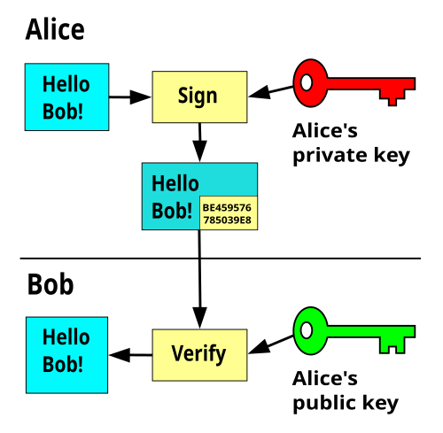

# Week 11: Focus on Integrity 

## Lecture 1: Digital Signatures, Certificates, PKI

### Digital Signatures

Big idea: Digital signatures are an asymmetric way of providing **integrity and authenticity** to data

A digital signature scheme consists of three algorithms:

  * A key generation algorithm that selects a private key at random from a set of possible private keys. The algorithm outputs the private key and a corresponding public key.
  * A signing algorithm that, given a message and a private key, produces a signature.
  * A signature verifying algorithm that, given the message, public key and signature, either accepts or rejects the message's claim to authenticity.

The primary reasons for using a cryptographic hash function H(M) are: 1. Asymmetric operations (signing/verification) are slow, so you sign a short hash instead of a long message. 2. It allows signing arbitrarily long messages.

Security Property: Digital signature schemes are secured against EU-CPA (Existentially Unforgeable under Chosen Plaintext Attack).

**Digital signatures don't prevent the replay attack**

#### **Scenario: Credit Card Authentication**

* **Key components**

* The Card (Chip): Contains a unique, secret Private Key. This key never leaves the chip and is used to create digital signatures. It also contains the corresponding Public Key embedded in a digital certificate.

* The Card Issuer/Payment Network (CA): Acts as a Certificate Authority (CA). It uses its own private key to sign the card's public key, creating a Digital Certificate that verifies the public key belongs to a legitimate card.

* The Terminal (POS Reader): Contains the public keys of the major Card Authorities (e.g., Visa, Mastercard) and uses them to verify the card's certificate and signature.

* Credit Card Authentication, particularly with modern EMV (chip-and-PIN) cards, relies heavily on public key encryption to establish trust through digital signatures.

* This process is based on Public Key Infrastructure (PKI) and is primarily used for Dynamic Data Authentication (DDA), which ensures the card is genuine and that transaction data has not been modified.

1. The Key Components

* The system operates on a chain of trust involving three main entities:

    * The Card (Chip): Contains a unique, secret Private Key. This key never leaves the chip and is used to create digital signatures. It also contains the corresponding Public Key embedded in a digital certificate.

    * The Card Issuer/Payment Network (CA): Acts as a Certificate Authority (CA). It uses its own private key to sign the card's public key, creating a Digital Certificate that verifies the public key belongs to a legitimate card.

    * The Terminal (POS Reader): Contains the public keys of the major Card Authorities (e.g., Visa, Mastercard) and uses them to verify the card's certificate and signature.

2. The Authentication Process (Digital Signature)

* When you insert a chip card, the primary goal is to perform a secure, dynamic authentication of the card's authenticity.

    * Data Preparation: The payment terminal generates unique transaction data, including the transaction amount, date, time, and a random number (called an Unpredictable Number). This ensures the signature will be unique for every transaction and cannot be simply replayed by a fraudster.

    * Signature Creation (on the Card):

        * The card chip takes all the unique transaction data and runs it through a hashing algorithm to create a small, fixed-length message digest (or hash).

        * The card then uses its unique, secret Private Key to encrypt this hash, creating the digital signature (often called a cryptogram or Application Cryptogram).

    * Signature Verification (on the Terminal):

        * The terminal receives the transaction data, the digital signature, and the card's public key (which it verifies via the CA chain).

        * The terminal performs two simultaneous actions:

            * It uses the card's Public Key to decrypt the digital signature, recovering the original message digest.

            * It independently generates a second message digest by running the transaction data it received through the same hashing algorithm.

        * Authentication: If the recovered message digest matches the one the terminal generated, the authentication is successful.

### Certificates and Chain of trust

* A certificate is a signed endorsement/signature of someones public key. It contains two things, the identity and the key

* Issue: No mechanism to verify that a public key belongs to its claimed owner. Public-key cryptography alone is not secure against man-in-the-middle attacks

* So how do we make a chain of trust? You cannot gain trust if you trust nothing. You need a root of trust!

* EvanBot: EvanBot is our trust anchor (root of trust)
  * Alice wants Bob’s public key. Alice trusts EvanBot
* We can expand/scale this idea to a **Hierarchal Trust Chain**
  * The root of trust (trusted directory) may delegate trust and signing power to other authorities
  * We can get around the brittleness of this scheme (single point of failure being root node) by creating multiple trust anchors.
  * Public keys are hard-coded into operating systems and devices

* We can use OpenSSL on the SEED virtual machine to obtain Google's certificate chain, or we can open cmd and type “certmgr.msc” to browse certificate chains on windows
  * Read cert chain from bottom to top, where the top is the for example web server, and you work up the chain

### PKI: Public Key Infrastructure

PKI Components: The full Public Key Infrastructure includes the: Certificate Authority (CA) (Root and Intermediate), Registration Authority (RA), Certificate Repository (which stores Certificate Revocation Lists (CRLs)), and optionally a Verification Authority (VA) (which uses the OCSP protocol).

* Public-key cryptography: Two keys, private and public
* Public-key encryption: One key encrypts, the other decrypts
* Security properties similar to symmetric encryption
* Hybrid encryption: Encrypt a symmetric key, and use the symmetric
key to encrypt the message
* Digital signatures: Integrity and authenticity for asymmetric schemes
* RSA Sigature: Sign (Encrypt) the hash with the private key
* Other popular signature schemes: DSA, ECDSA, EdDSA, BLS...

* **SEE WEEK 10 notes for more RSA**

## Day 3:

### What makes a good hash function?

* our goal here is just to learn what makes a good fash function and when we need to use one 

* good hash functions should be deterministic
* good hash functions should be unpredictable
* good hash functions should be resistant to collisions 
* good hash functions should be one-way; near impossible to reverse

* he makes a note that because hash functions map variable length data to a fixed length, there are technically infinite collisions for a certain hash in the hash table

* Confidentiality: Hash functions, by themselves, do not provide integrity if the attacker can modify both the message and the hash, because there is no secret key involved. They leak data

* Standard Examples: MD5 and SHA-1 are considered completely broken. SHA-2 (SHA-256/512) and SHA-3 (Keccak) are the current standards. Note that some SHA-2 variants are vulnerable to a length extension attack.

### Message Authentication Codes (MACs)

* MACs provide integrity
* NMAC (nested mac) is secure
* HMAC (hash-based mac) 
  * only requires one key
  * he said this is a good choice, more popular 

A Message Authentication Code (MAC) is a string of bits that is sent alongside a message. The MAC depends on the message itself and a secret key. No one should be able to compute a MAC without knowing the key. This allows two people who share a secret key to send messages to each without fear that someone else will tamper with the messages. (At least, if someone does tamper with a message, this can be detected by checking to see if the MAC is right.)

The term "MAC" can refer to the string of bits (also called a "tag") or to the algorithm used to generate the tag.

**HMAC is a recipe for turning hash functions** (such as MD5 or SHA256) into MACs. So HMAC-MD5 and HMAC-SHA256 are specific MAC algorithms, just like QuickSort is a specific sorting algorithm.

There are other ways of constructing MAC algorithms; CMAC, for example, is a recipe for turning a blockcipher into a MAC.

* Dr. Z notes that macs probably cant provide authenticity; researchers think it cant, but maybe dont know for sure
  * he said look into AEAD, its used in protocols like TLS 1.3 and QUIC. 

* The core difference between a hash and a MAC is that a MAC tag T=MAC(K,M) requires a secret key K. This ensures only someone with the key can generate a valid tag, providing authenticity (and integrity). note that "HMAC" is a specific construction of a MAC (from a hash function).

* Method 1: Store H(M) for message M, where H is a cryptographic has function

* Method 2: Store HMAC(K,M) for message M, where K is a secret key

* in this situation, the advantages of using method 2 over method 1 are: it provides both integrity and authenticity, while Method 1 only provides integrity under limited circumstances.Method 1 (Hash): The hash function H is public knowledge (no secret key). An adversary (Mallory) can modify the original message M to M′ and then easily compute and substitute the correct new hash H(M′). The receiver has no way to verify that the message actually came from a trusted sender (authenticity).

Method 2 (HMAC): The calculation of the Message Authentication Code (MAC) requires the secret key K (i.e., MAC(K,M)). Only the legitimate sender and receiver share this key. If Mallory modifies the message M to M′, she cannot calculate the correct HMAC(K,M′) without knowing K. Therefore, the receiver can verify that the message originated from someone who possesses the secret key, providing message authenticity.

* Now, if we were to compare a MAC to an HMAC, HMAC has the stronger property of being a pseudo-random function (PRF). This means that if Eve doesn't know the key, then all of Bob's HMAC tags look like completely random strings of bits, even if Eve knows or even chooses what messages Bob sends. 

### MAC VS PKI

* See tidbits for final for MAC vs PKI
  * main difference is symmetric vs asymmetric key and non-repudiation (If the recipient passes the message and the proof to a third party, can the third party be confident that the message originated from the sender?)
  * CA's/PKIS provide this via the fact that they are asymmetric and you can verify with the public key. with HMAC, you would have to verify with the same hash and private key 

### Diffie-Hellman Key Exchange: method of securely generating a symmetric cryptographic key over a public channel

* Formula:

* we agree on the public parameters: the large prime p, the generator g
  * then each party sends their message (equal to g^secret key mod p)
  * from this, the other party can calculate the secret message (equal to receivedmessage^secretkey mod p)

  * **(g^a)^b mod p = (g^b)^a mod p**

* funny note; apparently the paper was initially rejected from a journal for being too radical
* Relies on the discrete log problem for computational hardness 

* vulnerable to man in the middle attack:
  * "The Diffie-Hellman key exchange is vulnerable to a man-in-the-middle attack. In this attack, an opponent Carol intercepts Alice's public value and sends her own public value to Bob. When Bob transmits his public value, Carol substitutes it with her own and sends it to Alice. Carol and Alice thus agree on one shared key and Carol and Bob agree on another shared key. After this exchange, Carol simply decrypts any messages sent out by Alice or Bob, and then reads and possibly modifies them before re-encrypting with the appropriate key and transmitting them to the other party. This vulnerability is present because Diffie-Hellman key exchange does not authenticate the participants. Possible solutions include the use of digital signatures and other protocol variants."

This vulnerability can be solved via digital signatures

* can also be solved if the parties have a pre-shared secret key. with this, we can authenticate the d-f params via MAC
  * so why if they already have a shared private key, why do we need d-f?
    * d-f provides **forward secrecy**

* What values can be observed during transit? 
 * An adversary (Eve/Mallory) observes the public parameters: the large prime p, the generator g, Alice's public value A=ga(modp), and Bob's public value B=gb(modp). The shared secret K=gab(modp), or a or b cannot be computed from these public values (this is the computational difficulty of the Diffie-Hellman problem).

