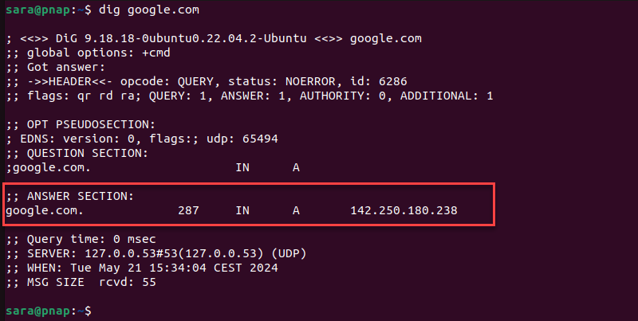

# DNS & UDP

## Things that tripped me up on this weeks quiz

* **Note** This is different in the actual textbook excercise in which this is true? From week #4 quiz but fits better here: 3.1-2 Transport-layer functionality. True or False: The transport layer provides for host-to-host delivery service?: False

* From week #4 quiz; 3.3-08 UDP Checksum: how good is it? True or False: When computing the Internet checksum for two numbers, a single flipped bit in each of the two numbers will always result in a changed checksum.: False, if you add two numbers, say 1 and 4, together and get a sum, and then change these numbers to 2 and 3, respectively, the sum remains 5. But if you change those original numbers to 2 and 6, the sum now changes to 8. So - if you change both of the numbers, the sum can change, but does not always change for all possible changes in the two values. Similar reasoning holds with a checksum.

## DNS, Dig command

* **Hostname vs. Domain Name**
    * A **Hostname** (e.g., `www.msoe.edu`) is a human-readable label that does not contain direct routing information.
    * The **Domain Name System (DNS)** is an application-layer protocol that translates a domain name into an **IP address**, which is necessary for machines to route datagrams.

* **DNS Tables (Resource Records)**
    * DNS uses a distributed database where information is stored in **Resource Records (RRs)**.
    * An **A Record (Address)** maps a hostname to an IP address.
    * An **NS Record (Name Server)** maps a domain to the hostname of the authoritative name server for that domain.

* **DNS Protocol Messages**
    * DNS is a client-server, request-response protocol, involving a **DNS Query** and a **DNS Response**.
    * The message header contains an ID number, **Flags** (like the QR bit for Query/Response and the RD bit for Recursion Desired), and counts for the different record types (Question, Answer, Authority, Additional).

* **Authoritative & Recursive DNS**
    * **Authoritative Servers** hold the definitive (non-cached) hostname-to-IP address mappings for a domain. They sit at the bottom of the DNS hierarchy.
    * The **Local DNS Server** (or **Recursive Resolver**) is the server a host first contacts. It performs **recursive queries** up the hierarchy (Root, TLD, then Authoritative) on the client's behalf to resolve the name, and then caches the result.
    * Recursive vs iterative DNS
        * Recursive DNS is when a client asks a DNS resolver for a domain, and the resolver does all the work (querying root, TLD, authoritative servers) to get the final IP, returning it to the client. Iterative DNS is when the client (or resolver) asks a server, gets a referral (another server to ask), and then queries that next server directly, repeating until the answer is found, giving the client more control but spreading the load
    * The **`dig` command** is a utility used for performing DNS lookups and troubleshooting.

* **DNS Caching**
    * Why does the local DNS server perform caching?: 1. DNS caching results in less load elsewhere in DNS, when the reply to a query is found in the local cache. 2. DNS caching provides for faster replies, if the reply to the query is found in the cache.

* **DNS Time to Live**
    * A setting in a DNS record that determines how long a piece of information should be cached by a resolving name server before it is refreshed. Measured in seconds, a higher TTL can speed up lookups by allowing more frequent use of cached data, while a lower TTL ensures that changes to DNS records, such as when migrating a server, are propagated more quickly

## DNS record types (non exhaustive list)

* A (Address) Record: Maps a domain name (e.g., example.com) to an IPv4 address (e.g., 192.0.2.1).
* AAAA (Quad-A) Record: Maps a domain name to an IPv6 address.
* CNAME (Canonical Name) Record: An alias, pointing one domain/subdomain to another domain name (e.g., www.example.com to example.com).
* MX (Mail eXchange) Record: Specifies mail servers responsible for accepting email for a domain.
* NS (Name Server) Record: Identifies the authoritative name servers for a DNS zone.

## Dig command & DNS fields:

* the standard output to a dig command without flags has 5 sections: HEADER, QUERY, ANSWER, AUTHORITY and ADDITIONAL.

### **The ANSWER SECTION:**

* The first column lists the name of the server that was queried.
* The second column is the Time to Live, a set timeframe after which the record is refreshed.
* The third column shows the query class. In this case, IN stands for Internet.
* The fourth column displays the query type. In this case, A stands for an A (address) record.
* The final column displays the IP address associated with the domain name.

### **Authority Section**

* The Authority section indicates the server(s) that are the ultimate authority for answering DNS queries about that domain.

* The reason for this section is that you can query any* DNS server(s) to answer a query for you. That server may choose though to answer the query from a cache. However, if you want to ensure you get an authoritative response ("from the horses mouth" so to speak) - you should ask the server(s) in the authority section. 

### **Additional Section**

* The ADDITIONAL SECTION contains data that you did not explicitly ask for, but the server gave it to you anyway.
* For example, if you asked a DNS server for all resource types and got NS records, the same authoritative server might also know the A and AAAA records for those nameservers and think its was helpful to give then to you. 

***

## UDP protocol

* **UDP Properties**
    * UDP (User Datagram Protocol) is a "bare bones," "best effort" transport protocol.
    * It provides **unreliable, unordered delivery**; segments may be **lost** or delivered to the application out-of-order.

* **Connectionless**
    * UDP is **connectionless**—it requires **no handshake** or connection setup (unlike TCP), which eliminates the delay of connection establishment.
    * Each UDP segment is handled independently.

* **HTTP/3 uses UDP**
    * Some modern protocols, such as **HTTP/3** (via QUIC), use UDP as their transport layer foundation.
    * If applications using UDP require reliability, in-order delivery, or congestion control, that functionality must be implemented in the **application layer**.

* **Checksum**
    * The UDP segment header includes a **checksum**.
    * Its sole goal is to detect errors (flipped bits) that may have occurred during transmission. The Internet checksum uses a one's complement sum for calculation and verification, offering weak error protection.

* **Multiplexing vs. De-multiplexing**
    * **Multiplexing (Sender):** The transport layer collects data from multiple application processes (sockets) and adds a transport header.
    * **De-multiplexing (Receiver):** The receiving host uses the header information, specifically the **destination port number**, to direct the incoming segment to the correct application **socket**.
    * UDP demultiplexing uses *only* the destination port number; segments with the same destination port but different source IP addresses or source ports are delivered to the same socket.