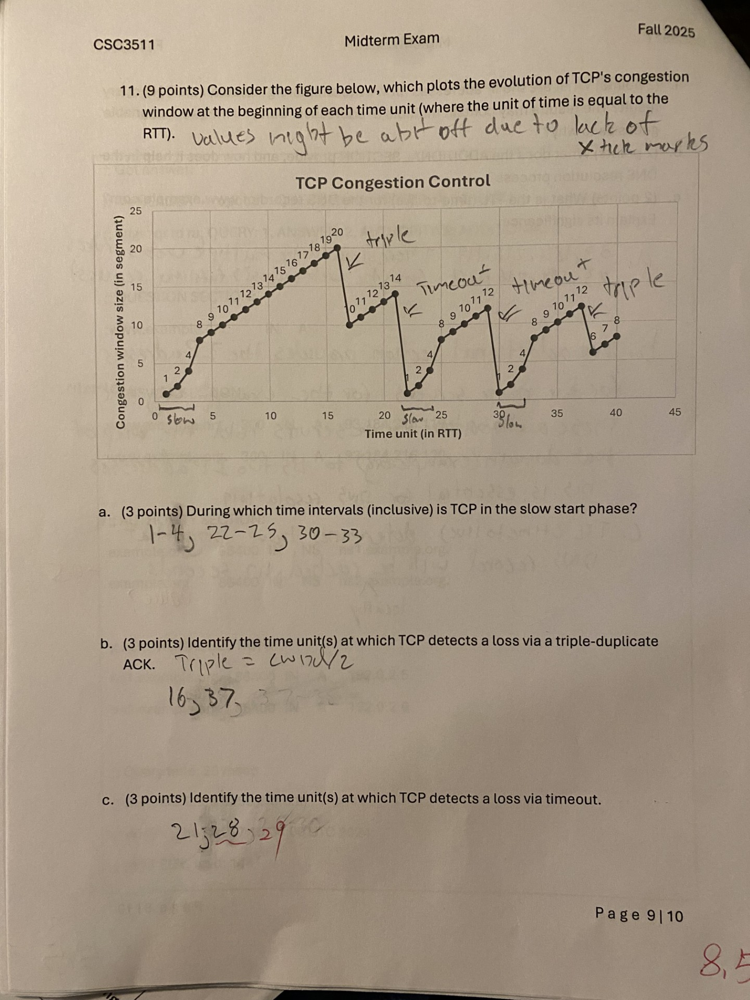

# Network Layer

## Things that tripped me up on this weeks quiz

* TCP Congestion control 

## Network Layer and IP Protocol

---

## Network Layer: Overview
* **Function:** The Network Layer (Layer 3/IP) transports a **segment** from a sending host to a receiving host.
* **Packet Handling:**
    * **Sender:** Encapsulates transport layer segments into **datagrams** and passes them to the link layer.
    * **Receiver:** Delivers the segments to the transport layer.
* **Protocols Location:** Network layer protocols run on all Internet devices: **hosts** and **routers**.
* **Internet Service Model:** The Internet uses a **"best effort"** service model, which provides **no guarantees** on:
    * Successful datagram delivery to the destination.
    * Timing or order of delivery.
    * Bandwidth availability for the end-to-end flow.
* **The Internet Protocol (IP):** The dominant network layer protocol that provides this host-to-host delivery service.

## Two Key Network Layer Functions

| Function | Description | Location/Logic | Analogy |
| :--- | :--- | :--- | :--- |
| **Forwarding** | Moving packets from a router's input link to the appropriate output link. | **Data Plane** (Local, per-router, nanosecond time scale) | Getting through a single interchange. |
| **Routing** | Determining the entire route taken by packets from a source to a destination. | **Control Plane** (Network-wide logic, second time scale) | Planning a trip from start to finish. |

## The Internet Protocol (IP)
IP provides or relates to the following functions and concepts:
* **Addressing:** Assigns a logical **IP address**.
* **Encapsulation:** Wraps transport layer segments in IP datagrams.
* **Forwarding:** Moves packets hop-by-hop toward the destination.
* **Fragmentation:** Breaks/reassembles packets to handle different link MTUs (Maximum Transmission Units).
* **Related Protocols:** **DHCP** (automatic IP assignment), **NAT** (private $\leftrightarrow$ public addresses), **ICMP** (error reporting), and **ARP** (address resolution).

## IP (v4) Addresses
* **Definition:** A **32-bit number** that uniquely identifies a network **interface** (the connection point between a device and a network).
* **Notation:** Commonly written in **Dotted-quad (dotted-decimal) notation** (e.g., `220.232.93.154`).
* **Hierarchical Structure:**
    * **Network Prefix (High-order bits):** Identifies the **subnet** (local network). Hosts on the same subnet can communicate directly.
    * **Host Portion (Low-order bits):** Identifies the specific host/interface on the network.
* **Specifying the Split:**
    * **Slash Notation (CIDR: Classless Inter Domain Routing):** `a.b.c.d/x`, where `x` is the **prefix length** (the number of bits in the network prefix).
    * **Netmask Notation (Older):** A 32-bit number where all network prefix bits are `1`s and host bits are `0`s (e.g., `255.255.255.0` for a `/24`).

## Dynamic Host Configuration Protocol (DHCP)
* **Goal:** A host dynamically obtains its IP address, network mask, and other configuration information when it joins a network.

* DHCP is based on mac address. (how else does the IPless device contact the DHCP server?)
* **Process (DORA):**
    1.  **Discover:** Client broadcasts a **DHCP discover** message.
    2.  **Offer:** Server responds with a **DHCP offer** message (optional).
    3.  **Request:** Client broadcasts a **DHCP request** to formally accept an address.
    4.  **ACK:** Server sends a **DHCP ACK** with the final configuration information (including the address lease time).
* **Information Provided:** Allocated IP address, network mask, IP address of the DNS server, and the IP address of the first-hop router.

## Network Address Translation (NAT)
* **Purpose:** To conserve the limited **IPv4** address space by allowing a local network (e.g., a home network) to use **private IP addresses** (e.g., $10.0.0.0/8$) and share a **single public IP address**.
* **Mechanism (NAT Router):**
    * **Outgoing:** The router replaces the host's private (Source IP, Port \#) with the router's public (NAT IP, new Port \#) in the packet header.
    * **Incoming (Reply):** The router uses a **NAT translation table** to map the public (NAT IP, Port \#) back to the correct host's private (Source IP, Port \#) for delivery.
* **Advantages:** Address conservation and security (devices inside the local network are not directly addressable/visible from the outside).

### A quick note on tricky translations

## IPv6
* **Motivation:** IPv4 address exhaustion.
* **Key Difference:** Addresses are **128 bits** long, compared to 32 bits for IPv4.
* **Notation:** Uses **hexadecimal** with a colon between every 4 hex digits (16 bits). Long strings of zeros can be compressed with `::` once per address. E.g., `2001:DB8::1`.

---

## Forwarding and Routing

---

## Review: Router Architecture

| Component | Function |
| :--- | :--- |
| **Input/Output Ports** | Handle the physical and link layer operations, perform packet lookups, and queue packets. |
| **Switching Fabric** | Connects the input ports to the output ports, responsible for high-speed packet transfer. |
| **Routing Processor** | Runs the routing protocols (Control Plane) and populates the forwarding table. |

## Switching Fabrics
* **Definition:** The rate at which packets can be transferred from inputs to outputs is the **switching rate** (ideally $N$ times the line rate $R$ for $N$ inputs).
* **Types:**
    * **Bus:** Uses a shared bus to move datagrams.
    * **Interconnection Network (Crossbar):** A multi-stage switch that fragments datagrams into fixed-length cells, switches the cells, and reassembles the datagrams.
    * **Memory:** Switching is controlled directly by the CPU (traditional/older method).

## Forwarding Pipeline (Linecard Processing)
When a packet arrives at an input port, the linecard performs the following steps:
1.  **Receive/Assemble:** Receives signals and assembles the data packet.
2.  **Parse:** Reads and interprets the packet headers (e.g., IPv4 or IPv6).
3.  **Lookup:** Uses the forwarding table to determine the **next hop** (the appropriate output port).
4.  **Update:** Decrements the TTL (Time-to-Live) field, updates the checksum, and fragments the packet if it's too large.
5.  **Send:** Passes the packet to the output port via the switching fabric.

## Efficient Forwarding: Longest Prefix Matching

* **Destination-Based Forwarding:** The router's forwarding table maps destination IP address ranges (**prefixes**) to specific output link interfaces.
* **The Challenge:** Multiple address prefixes in the forwarding table can match a single destination IP address (e.g., a packet matches `/16`, `/24`, and `/32` entries).
* **Longest Prefix Matching (LPM):**
    * To resolve this ambiguity, the router must select the entry with the **most specific (longest)** address prefix match.
    * If a packet matches multiple prefixes, the one with the most matching bits is chosen.
    * If no prefix matches, the packet follows the **default route** (if one exists) or is dropped.
* **Data Structure:** A **Trie** is a specialized tree-based data structure used to implement fast LPM lookups by spelling out the destination address bit by bit.

## Output Port Queuing
* **Queueing:** Buffering of datagrams is necessary when the arrival rate from the switching fabric exceeds the output link's transmission rate.
* **Packet Loss:** Datagrams can be lost if buffers become full (a "drop policy" is enacted).
* **Scheduling:** A scheduling discipline chooses which queued datagram will be transmitted next. Examples include First Come, First Served, Priority, and Weighted Fair Queueing.

## Least Cost Routing, learning network graph 

## TCP congestion control:

    - Slow Start
        - slow start with exponential build in cwnd
    - loss via triple duplicate ack 
        - when triple duplicate ack detected, we decrease cwnd by half (SSThresh)
    - loss via timeout
        - when timeout detected, drop back 1, redo slow-start

