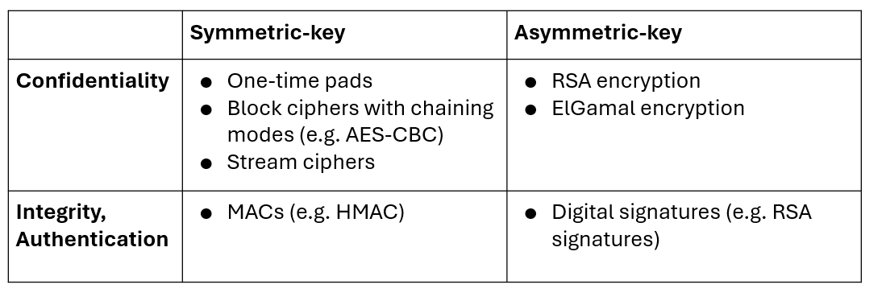

# DNS Vulnerabilities & Attacks & Intro to Cryptography

## A Quick DNS review:

* A map between hostnames and IP addresses
* Name servers are arranged in a hierarchy 

## What exactly is in a DNS packet?

* Source & destination IP addresses
* Source and Destination Port numbers
* Query ID
* Counts 

## DNS Caching

* DNS responses are cached locally for quick translations
* Attach a TTL to the cached record so they time out and dont stay in the cache even though they may be wrong as the IP for the server has now changes
* DNS negative queries are also cached (sites that dont exist, mis-spelling of the actual domain name)

## Why Care about DNS security?

* Trust and the stability of the DNS system as a whole drives the global economy. Nobody, not even tech bros want to type in the IP address of a site, especially considering that is constantly subject to change.

* DNS hijacking occurs when the actor can illicitly modify DNS name records to point users to actor-controlled servers

## DNS Threat Model

* Malicious name server, external attacker
* Attacks that can be launched: Forged DNS data, Hijacked DNS name server
* DNS flood

### Malicious Name Servers

* Malicious name servers can lie and supply a malicious answer
* Malicious records could also poison the cache with other records
* DNS query results include Additional Records section:
* Provide records for anticipated next resolution step

## DNS poisoning

* Returning false information into the DNS cache
* The victim will cache the malicious records, “poisoning” it
* Later, DNS queries return an incorrect response, and users are directed to the wrong websites

* **Example:** Supply a malicious record mapping the attacker’s IP address to a legitimate domain
Now when the victim visits google.com, they’ll actually be sending packets to the attacker (6.6.6.6), who can launch the MITM attack!

### Kaminsky Attack

* Dan Kaminsky, security researcher, noticed that DNS clients would cache additional glue records as if they were authoritative answers, even though they aren’t

#### Kaminsky Vs. Previous attacks

* **Previous attacks: poison the final answer, the type A record with the IP address, Kaminsky Attack: goes up one level and hijacks the authority records (NS record) instead**

Mechanism: The attack requires the attacker to flood the recursive resolver with forged responses while repeatedly querying for a non-existent, random subdomain (e.g., fake1.google.com) to force a new authoritative query, increasing the chance of guessing the correct Query ID for a given domain .

In a spoofed response from the .com server, Bob can:

1. Put an NS record in the Authority section claiming that example.com's nameserver is at a domain he controls;

2. Put a corresponding A record in the Additional section, mapping that nameserver to his malicious IP.

## Introduction to Cryptography

### What is cryptography

    • Older definition: The study of secure communication over insecure channels
    • Newer definition: Provide rigorous guarantees about the data and
    computation in the presence of an attacker
      • Not just confidentiality but also integrity and authenticity

### Three Goals of Cryptography

In cryptography, there are three common properties that we want on our data

* Confidentiality: An adversary cannot read our messages
* Integrity: An adversary cannot change our messages without being detected
* Authenticity: I can prove that this message came from the person who claims
to have written it
* Integrity and authenticity are closely related properties:
  1. Before I can prove that a message came from a certain person, I have
  to prove that the message wasn’t changed!
  2. But they’re not identical properties. Later we’ll see some edge cases

### Threat Models

Kerckhoff's Principle: This is a fundamental security principle stating that a cryptosystem must be secure even if the attacker knows all internal details of the system; the key should be the only thing that must be kept secret.

Key Models: The two main models are Symmetric key (Alice and Bob share the same secret key) and Asymmetric key (a user has a private key and a public key)

###  IND-CPA (indistinguishability under chosen plaintext attack)

A security property for an encryption scheme where an attacker cannot distinguish between the ciphertexts of two different plaintexts, even if the attacker can choose plaintexts to be encrypted

An encryption scheme is IND-CPA secure if an attacker (Eve) can win the guessing game with a probability of only ≤1/2+ϵ (where ϵ is a negligible advantage). This means the ciphertext has leaked no information beyond what the attacker already knew

### Caesar Cipher

A Caesar cipher, also known as Caesar's cipher, the shift cipher, Caesar's code, or Caesar shift, is one of the simplest and most widely known encryption techniques. It is a type of substitution cipher in which each letter in the plaintext is replaced by a letter some fixed number of positions down the alphabet. 

The Caesar cipher is named after Julius Caesar, who, according to Suetonius, used it with a shift of three (A becoming D when encrypting, and D becoming A when decrypting) to protect messages of military significance.