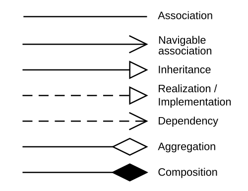

# Mid-term review day

big idea: we want to create a shared language with our users and then use that to make modular, adaptable software.

## is-a has-a, needs-a; composition, aggregation and uses

### this is where you should cover types of arrows & dotted vs non dotted

- open tipe
- filled in tip
- non enclosed open tip (stick figure arrow/simple arrow)

dont forget about inheritance

recall that the biggest benefit of interfaces is the ability to implement multiple, which is not the case for abstract classes

- Dependency: often times you can use the phrase "has-a" to describe these relationships, but a better test is if you can swap in "uses-a/references". Typically temporary. **Dependency is implied by association, but associations is not implied by depdendency** A dependency typically (but not always) implies that an object accepts another object as a method parameter, instantiates, or uses another object
    - **book notes that uses is the dependency. dependency is a dashed line with a simple arrow**
- association; has-a/needs-a; both composition and aggregation are subsets of association An Association is used when one class has a permanent, structural, or persistent link to another class. **associations are represented as a solid line with a simple arrow** 
    - Composition: needs-a/consists of, implies ownership. A car needs a car
    - aggregation: has-a, but dont automatically assign all has a to aggregation. aggregation implies a **part-of** relationship, a Library class aggregates Book objects, a teacher aggregates (has) student objects. if the teacher leaves the school, the students will still be there. "aggregation means the contained objects are more like a collection of things." You see some stuff online about how this arrow is kinda redundant. 
    General example from the week #4 wednesday lecture: a vehicle registration has a vehicle field. 

the super green engine example is good, the classes have an association, the type non specified. 
- realization: can; implementing an interface; implements keyword in java
- generalization/inheritance: is-a, java with the extends keywords. a specific strategy is-a strategy

    https://www.umlboard.com/docs/relations/

## RIBS: cover identity again; find examples of each letter in the acronym 

    responsibility, identity, behavior, state. Look for these when designing domain objects

## goal of domain driven design; the objects the customer is thinking of

## Coupling: best type of coupling = Data coupling; Worst case of coupling = content/do it class

    - coupling is bad because we want to limit the amount of data flow between classes to limit how much certain classes are dependent on each-other to function. Very interdependent classes makes spaghetti

    From worst to best: 
    - Content coupling: Do it class
    - Common Coupling: public attributes that should be private. If no visibility given java gives it package level visibility 
    - external coupling: In wed week 4 lecture note: "External: not covered - Probably low concern"
    - control coupling: information in one module dictates logic in another
    - Stamp coupling: passing in entire objects including unnecessary fields. "passing large structure and using just a portion"
    - Data coupling: only passing exactly what you need: getting a private field using a getter and returning the value of that field 
    - None: typically not possible

## Cohesion: worst type of coupling is still a do it class becuase it does too much

Week #4 friday lecture has all of them down in a row!!
    you need to cover all examples of cohesion better
    Understand the difference between temporal procedural and sequential coupling
    specifically procedural vs temporal

    Cohesive military unit: one goal, strong team

    From worst to best:
    - Coincidental cohesion: Do it class; everything is in there just because. example: putting all of your GUI code in a single form class
    - Logical cohesion: The result of control coupling: example: A class that handles all the errors 
    - Temporal cohesion: tasks that are related just by when they are done. example: initializing all data structures/state variables
    - Procedural cohesion: tasks designed based on being able to be invoked in a particular order. example: ReadPartNumberFromDatabaseAndUpdateRepairRecord
    - Communicational cohesion: tasks which are together because they process the same data example: ComputeAverageAndPrint which contains a loop to compute an average and then prints it at the end **typically only an issue with methods**
    - Sequential cohesion: activities are related and output for current activities is input for next activity 
    - Functional cohesion: highest level module does one task only!

    https://stackoverflow.com/questions/41743472/what-is-difference-between-procedural-cohesion-and-sequential-cohesion-in-softwa

## review design patterns

### How do each of these affect coupling & cohesion?

- From week 3 wednesday lecture: 
How does the Adapter Pattern improve coupling, cohesion?
– Lower coupling, no impact to cohesion
• How does the Strategy Pattern improve coupling, cohesion?
– Higher cohesion, but possibly higher coupling
• What does the Singleton Pattern do to improve coupling,
cohesion?
– Lower coupling; if alternative is no class, higher cohesion
• Note:
– Adapter, Null Object, (Decorator): structural patterns
– Strategy: behavioral pattern
– Singleton: creational pattern
• Structural patterns are generally about reducing coupling

- null object; removes the need for If null checks. exists in a place where theres an option to do something but the specific class cannot do it; like a sedan with a plow. it would have a null plow. Maybe a blank button panel on a car would fit that as well? This could represent a ButtonPanel object where the expected methods (e.g., pressButton(id), getButtonStatus(id)) There needs to be an object there but it can't do anything. Double check this but null objects are typically concrete implementations
- Singleton; only one of something can exist, and it must be Unique instance! This is more than just saying that an instance of a class is associated with exactly one instance of another class; two cars might share the same type of engine, all engines have a unique serial number. The serial number should be implemented as a singleton pattern. Employee id is also a good example of the singleton. Its just that the thing is has needs to be unique 
- strategy pattern; A list of specific types of algorithm/ behaviors that are ; effects the objects behavior at run time.For instance, a class that performs validation on incoming data may use the strategy pattern to select a validation algorithm depending on the type of data, the source of the data, user choice, or other discriminating factors. These factors are not known until runtime and may require radically different validation to be performed. **this would be a good one to give an example sequence diagram for**
- get more comfortable with the difference between adapter vs decorator 
     A decorator is dressing someone up; adaptor is turning someone into a horse. Adapter changes the interface of an object to adapt it to another interface. A decorator has the same interface of the thing it decorates, it just adds new functionality. The adapter adapts a class to work with a new interface. Decorators are used to decorate individual objects at run-time. Adapters are used to add features to the class and therefore to ALL of its objects.
     a good example of decorators are in python, where decorators are used pretty heavily. 
     - see this link for why it makes sense to have an abstract decorator class instead of just extending the base abstract class
     - a decorator enhances the current object; for example an adaptor for a usb-c to 3.5mm jack **doesnt** enhance the capabilities of the usb-c (data, power transfer), it provides completely new functionality. 
public abstract class AbstractVehicleOption extends AbstractVehicle {
protected Vehicle decoratedVehicle;
public AbstractVehicleOption(Vehicle vehicle){
super(vehicle.getEngine(),vehicle.getColour());
decoratedVehicle=vehicle;
}
protected String getVehicleName(){
return getClass().getSimpleName()+" "+((AbstractVehicle)decoratedVehicle).getVehicleName();
}
- Observer pattern: a one-to-many dependency between objects, allowing one "subject" object to notify multiple "observer" objects automatically when its state changes. Gearbox observer pattern

- week 3 wed notes: "Singleton: based on how objects are created Strategy: how objects behave at run time Adapter: the structure of objects/classes"

Adapter, Null Object, (Decorator): structural patterns
– Strategy: behavioral pattern
– Singleton: creational pattern
• Structural patterns are generally about reducing coupling

Individual methods:
• Cohesion = what a method does
• Coupling: interactions though parameters, attributes, static data, etc.
Subsystem = any portion of the whole system
• Typically, something developed by a team
• On smaller projects: developed by an individual
• Collection of classes, package, etc.
• Measuring coupling, cohesion of modules – a system’s modularity
• Any portion of the system: methods, classes, subsystems

## UML diagramming and sequence diagramming, ensure you know how the relationships and how they are represented

- arrows will be covered in the relationships section, here we need to cover basic symbols and sequence diagrams
    - public private protected
    - typesetting for interfaces vs abstract classes