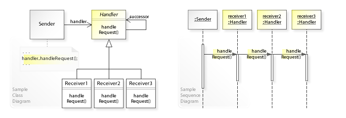
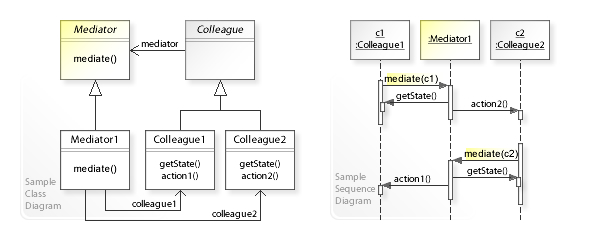
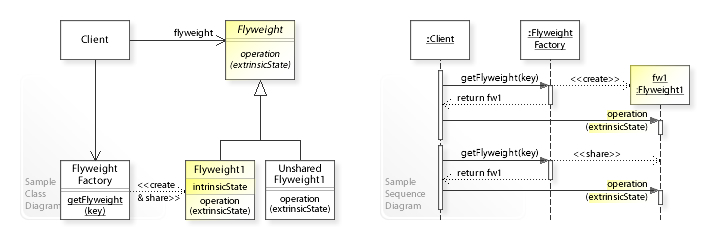
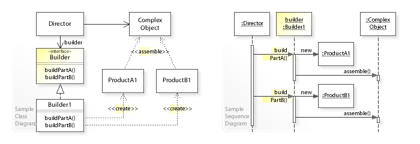

# Presentation Notes

## Chain of responsibility
 
 * Chain of handlers, e.g. a IT dept where a ticket filters through layers depending on severity 
 * **Interface:**

## State

## Mediator

* Similar to observer but through a single class (that "mediates"). Seems like it turns into an anti-pattern really quickly
* **Interface:**

## Flyweight

* A pattern for preventing the issue of large memory footprints when you have to create a bunch of objects from the same class. Flyweight pattern limits memory use by sharing parts, like images
* **Interface:**

## Builder

* A pattern for limiting complexity when building complex objects
* Allows you to create unique objects with a single constructor
* **Interface**

* This relates to the factory pattern;
  * The Factory pattern creates an entire object in a single method call, typically when the exact type is unknown until runtime, while the Builder pattern constructs a complex object step-by-step, providing more control over the configuration and composition process.